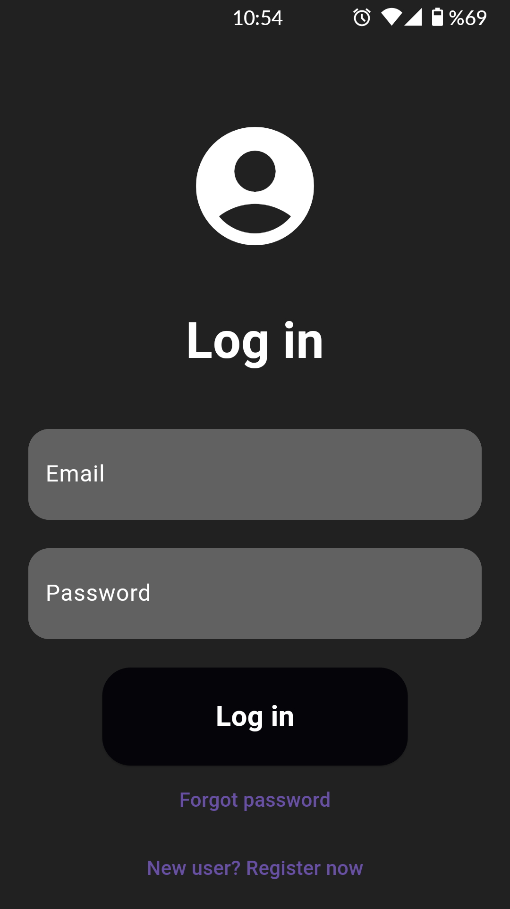
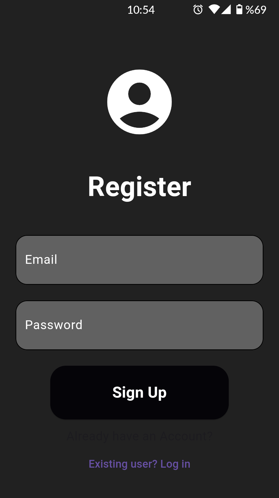

Study Squad is a rich repository of study materials spanning diverse formats and subjects. Users gain entry to an extensive array of books, notes, tests, and papers, providing valuable support for their studies. The platform empowers users to effortlessly download, open, or bookmark resources, ensuring swift and convenient access to essential study materials
                
